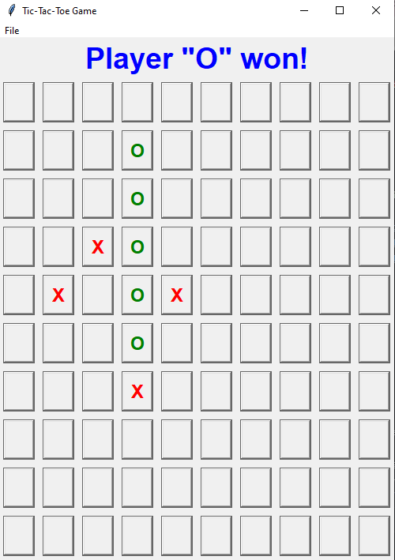
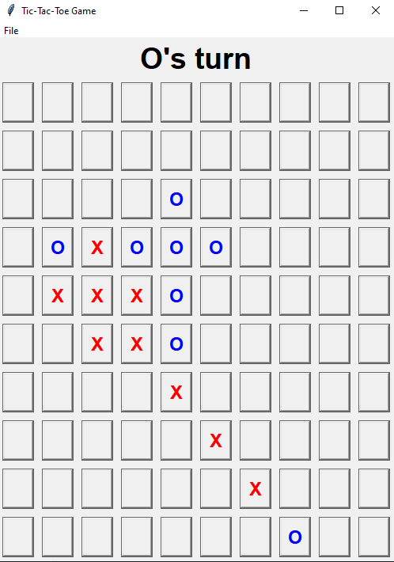

This is a tic-tac-toe game using Tkinter in Python but with different board sizes and rules.

# How to run game

First, clone this repository in a folder.
Make sure [Python](https://www.python.org/downloads/) is installed on this device.

Open the command line(terminal) in the folder containing the source code.
(See instructions for each Operating System here:
[Windows](https://adamtheautomator.com/windows-open-powershell-in-a-folder/),
[Linux](https://www.techrepublic.com/article/linux-101-how-to-quickly-open-a-terminal-in-a-specific-directory/),
[MacOS](https://www.maketecheasier.com/launch-terminal-current-folder-mac/))

Run this command inside the command line:
```bash
py main.py
```
After running successfully, you will be taken to the game board which will be empty to start. The game board has 100 squares in a 10x10 grid formation. This game's mode currently has only 2-player mode.

# How to play

Tic-Tac-Toe is a classic two-player board game played on a 3x3 grid. The game's objective is to be the first player to form a line of three symbols in a row, column, or diagonal. One player uses "X" and the other "O" to mark their moves on the board.

At the start of the game, the board should be empty. Decide if you want to go first or second. If going first, simply click on an empty square to place your marker there.

Now it's the second player's turn. The second player will place their marker in one of the empty squares.

Players alternate turns to click on empty squares to place their markers until one player gets 5 markers in a row horizontally, vertically, or diagonally. To win the game the segment containing 5 identical markers must not be blocked by the other marks on both sides.

Here are 4 examples of winning positions:





This is an example where the "X" player has gotten a diagonal line but it is blocked by "O" on both sides so that player hasn't won yet.



If there are no empty tiles left and no player can get 5 markers in a row, the game is considered a tie/draw.


After each completed game, you can play again by selecting the "File" option in the menu tab and then clicking "Play again". The game board will reset for another game.

Have fun and enjoy playing tic-tac-toe! The rules are simple but the strategy is key to winning.


